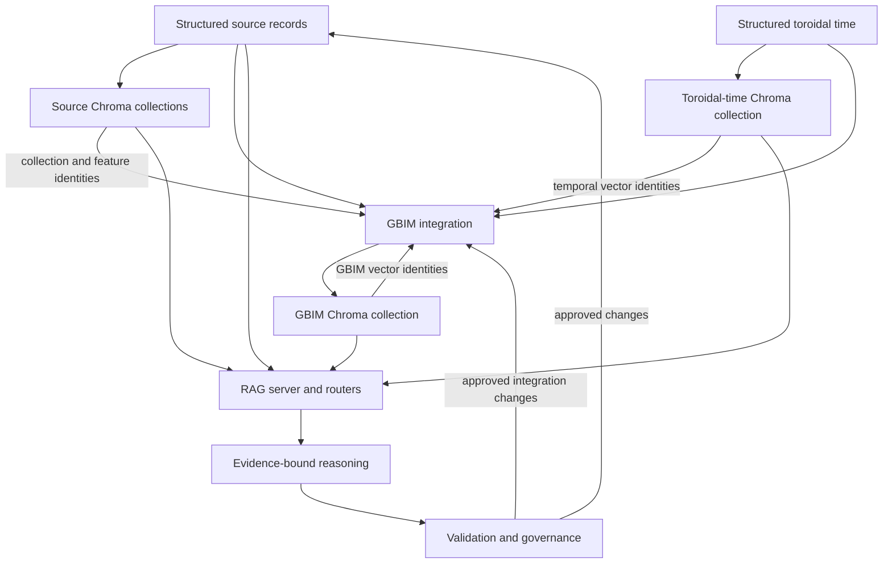
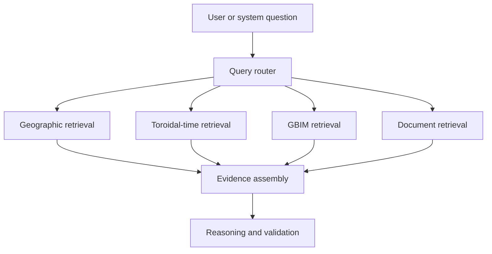

# 52 — The Recurrent Epistemic Loop

## Closing Structured State, Semantic Memory, GBIM, Toroidal Time, and Retrieval

**Ms. Allis / Ms. Jarvis Architecture**  
**Harmony for Hope, Inc.**  
**Carrie A. Kidd**  
**July 2026**

---

## Abstract

Ms. Allis is not organized as a single model, database, vector store, retrieval-augmented generation pipeline, or reasoning service. She is an operational composition of structured databases, geographic information, semantic vector collections, retrieval routers, temporal systems, language-model services, identity controls, evaluation mechanisms, and governed update processes.

The individual components acquire their full architectural meaning only when their outputs are returned to the system as identified, traceable, and versioned state. PostgreSQL preserves structured facts and exact geometry. Source-level Chroma collections provide semantic addressability. The Geographic Building Information Model, or GBIM, binds source records to their vectorized representations through stable identifiers, collection hashes, and feature hashes. Completed GBIM records are then vectorized into a GBIM Chroma collection, and those resulting identities are written back into structured state. Toroidal time participates as a peer source domain, receiving both a structured representation and a semantic representation before being integrated with the corresponding GBIM objects. The RAG server retrieves across these specialized representations and assembles evidence for reasoning, while governance mechanisms determine whether any resulting interpretation may modify persistent state.

This chapter defines that closed architecture as the **Recurrent Epistemic Loop**. The loop is recurrent because the system repeatedly reconciles structured facts, semantic representations, spatial identity, temporal position, and validated changes. It is epistemic because its purpose is not merely to store data, but to govern how the system identifies what it knows, how it knows it, where that knowledge applies, when it remains valid, and how one representation corresponds to another.

The recurrent loop must not be confused with unrestricted self-training or recursive generation. Model outputs do not automatically become facts, and repeated vectorization is not itself learning. Recurrence becomes operationally meaningful only when stable identity, provenance, content hashing, change detection, validation, access control, and stopping conditions prevent semantic feedback from overwriting source truth. Under those constraints, the architecture supports a continuously maintainable, geographically grounded, temporally situated, and retrieval-mediated world model.

---

## 1. The Missing Relationship Between the Components

Earlier chapters describe the principal systems through which Ms. Allis operates:

- PostgreSQL and GeoDB preserve structured and spatial records.
- ChromaDB provides semantic memory.
- GBIM integrates geographic objects and their identifying information.
- Hilbert-space models formalize state, similarity, decomposition, and cross-domain relationships.
- Toroidal time represents recurrence, phase, and cyclic temporal position.
- RAG pipelines retrieve relevant evidence.
- Routers select the appropriate domains and services.
- LLM ensembles interpret retrieved evidence and generate candidate conclusions.
- Identity systems distinguish users, communities, public actors, and protected information.
- Constitutional and operational safeguards constrain action.
- Evaluation systems test coherence, accuracy, authority, and system behavior.
- Heartbeats and watchdogs maintain live operational cycles.

These components do not form a completed epistemic architecture merely by existing beside one another. A set of connected services is not necessarily a learning system, and a group of vector collections is not necessarily a world model.

The missing relationship is the return path.

When structured records are vectorized, the system must preserve the identity of the vectorized representation. When GBIM integrates a source record with its semantic identity, the completed GBIM record must itself become semantically retrievable. When the GBIM representation is vectorized, the identity of that new representation must return to GBIM. When toroidal time is vectorized, its temporal features must remain traceable to structured temporal records and to the geographic or civic objects whose temporal states they describe.

The architecture becomes recurrent when representations do not terminate at the point of generation. They return as governed, identified, and verifiable state.

The central loop is therefore:

\[
\text{Structured Source State}
\rightarrow
\text{Source Semantic Memory}
\rightarrow
\text{GBIM Integration}
\rightarrow
\text{GBIM Semantic Memory}
\rightarrow
\text{Retrieval and Reasoning}
\rightarrow
\text{Validated State Reconciliation}
\rightarrow
\text{Updated Structured State}
\]

This loop does not erase the boundaries among systems. It depends upon them.

PostgreSQL remains structurally exact. Chroma remains semantically approximate. GBIM remains the binding and integration layer. Toroidal time remains a temporal domain. The RAG server remains the retrieval fabric. The reasoning services remain interpreters rather than unquestioned authorities.

The loop closes because each representation can be resolved back to the structured object, source, version, and process that produced it.

---

## 2. Architectural Definition

The **Recurrent Epistemic Loop** is the governed process through which Ms. Allis:

1. Acquires or updates structured source data.
2. Produces semantic representations of source features.
3. records the identities and hashes of those semantic representations.
4. Integrates structured and semantic identities within GBIM.
5. Vectorizes the completed GBIM records.
6. Returns the identities of the GBIM vectors to structured state.
7. Integrates structured and semantic representations of toroidal time.
8. Retrieves across source, GBIM, temporal, people, documentary, and operational domains.
9. Produces candidate interpretations or actions.
10. Validates those candidates against provenance, authority, policy, and current state.
11. Commits only approved changes.
12. Repeats the affected portions of the loop when state has materially changed.

This is not one undifferentiated cycle. It is a family of linked cycles operating at different scopes and frequencies.

A source feature may be vectorized once and remain unchanged for years. A public event may change weekly. A user session may produce temporary state every few seconds. A toroidal phase may advance continuously while its underlying event definition remains stable. A GBIM relationship may be recalculated only when one of its participating objects changes.

The recurrence is therefore **selective**, **event-driven**, and **content-addressed**. The entire system does not need to revectorize merely because one object changes.

---

## 3. The Full Loop



The diagram contains three distinct movements:

### 3.1 Outward representation

Structured facts are transformed into semantic representations.

\[
S \rightarrow V(S)
\]

### 3.2 Integrative binding

Structured source identity and semantic identity are joined within GBIM.

\[
G = B\left(S, V(S), T, V(T)\right)
\]

### 3.3 Governed return

Retrieved evidence produces candidate changes, but only validated changes return to persistent state.

\[
S_{n+1}
=
U\left(
S_n,
\operatorname{Validate}
\left(
R\left(S_n,V(S_n),G_n,V(G_n),T_n,V(T_n)\right)
\right)
\right)
\]

Where:

- \(S_n\) is the structured source state at cycle \(n\).
- \(V(S_n)\) is the vectorized source representation.
- \(T_n\) is the structured toroidal-time state.
- \(V(T_n)\) is its semantic representation.
- \(G_n\) is the integrated GBIM state.
- \(V(G_n)\) is the vectorized GBIM representation.
- \(R\) is retrieval and evidence assembly.
- \(\operatorname{Validate}\) is the governance and verification process.
- \(U\) is the controlled update function.

The validation function is essential. Without it, the system would create an uncontrolled feedback loop in which generated interpretations could be reintroduced as facts.

---

## 4. Source PostgreSQL as Structured State

PostgreSQL preserves the exact fields imported or created within the system. In GeoDB, this includes geographic layers, geometries, identifiers, source-specific attributes, coordinate systems, dates, classifications, and other operational values.

The source database is not merely an ingestion staging area. It serves as a structured evidentiary substrate.

A source record may contain:

- A primary or source-specific identifier
- A feature name
- A feature category
- Address information
- Geographic coordinates
- Point, line, polygon, or multi-part geometry
- Jurisdiction
- Administrative codes
- Physical attributes
- Infrastructure attributes
- Source organization
- Observation or publication date
- Edit history
- Status
- Quality indicators
- Dataset-specific values

The original source fields should remain available even when GBIM creates standardized fields. Normalization must not destroy evidence.

Source-specific attributes can be preserved within GBIM as JSONB, a related attribute table, or another structured representation that retains:

- Original column name
- Original value
- Original data type
- Source table
- Source record identifier
- Ingestion version
- Transformation history

This allows Ms. Allis to benefit from a canonical representation without pretending that every source agency uses the same vocabulary or ontology.

Structured state provides capabilities that vector memory cannot reliably replace:

- Exact equality
- Numeric comparison
- Date and interval calculation
- Spatial containment
- Spatial intersection
- Distance measurement
- Network analysis
- Referential integrity
- Uniqueness constraints
- Transactional updates
- Version control
- Auditability
- Deterministic filtering

A semantic vector may indicate that two records are similar. PostgreSQL can establish whether they share an identifier, occupy the same geometry, overlap within a defined tolerance, or were valid during the same interval.

---

## 5. Source Chroma Collections

Each source Chroma collection provides a semantic representation of a knowledge domain, dataset, layer, or operational corpus.

Examples may include:

- Geographic features
- Public infrastructure
- Historic resources
- Health services
- Transportation networks
- Environmental hazards
- Community resources
- Documentary knowledge
- People-space representations
- Policies and regulations
- Operational procedures
- Toroidal-time features

The source Chroma collections do not merely mirror table names. They make records retrievable through natural language, conceptual similarity, contextual relationships, and domain-specific phrasing.

A PostgreSQL feature such as a rural health clinic may contain fields whose original names are abbreviated or source-specific. The Chroma representation can express the feature in language that connects those fields to concepts such as:

- Rural healthcare
- Community health access
- Emergency preparedness
- Public services
- Transportation barriers
- Senior services
- Regional resilience

The embedding does not alter the source record. It adds a semantic address through which the source record can be discovered.

Each vectorized source feature should retain or produce at least four pieces of semantic identity:

- Source Chroma collection identifier
- Source Chroma collection hash
- Source Chroma feature identifier
- Source Chroma feature hash

The identifier and hash should not be treated as interchangeable without an explicit design decision.

An identifier answers:

> Which record should the system retrieve?

A hash answers:

> Does this representation correspond to the expected content and version?

A stable identifier should survive ordinary updates. A content hash should change when the content used to produce the representation changes.

---

## 6. Chroma Collection Hashes and Feature Hashes

The recurrent architecture depends upon identity at more than one resolution.

### 6.1 Collection identity

A collection represents a defined semantic domain or indexed dataset. Its identity may include:

```text
collection_id
collection_name
collection_hash
collection_version
embedding_model
embedding_dimensions
distance_metric
source_domain
created_at
updated_at
```

The collection hash may represent:

- The collection configuration
- The set of included records
- The embedding model and version
- The serialization rules
- The transformation pipeline
- A Merkle-style aggregate of feature hashes
- Another deterministically defined collection state

The exact meaning must be documented. A hash is useful only when the system knows what was hashed.

### 6.2 Feature identity

Each Chroma feature or document should have:

```text
feature_id
feature_hash
source_record_id
source_content_hash
embedding_input_hash
embedding_model
embedding_version
vectorized_at
```

These distinguish several possible changes:

- The source record changed.
- The text constructed from the source record changed.
- The embedding model changed.
- The vectorization pipeline changed.
- The metadata changed.
- The resulting vector representation changed.

A single opaque hash may detect that something changed, but multiple hashes allow the system to determine what changed and whether revectorization is necessary.

### 6.3 Deterministic identity

A feature identifier may be constructed from stable source identity:

\[
\operatorname{feature\_id}
=
H(
\operatorname{namespace},
\operatorname{source\_table},
\operatorname{source\_record\_id}
)
\]

The content hash may be defined separately:

\[
\operatorname{feature\_hash}
=
H(
\operatorname{canonicalized\ embedding\ input}
)
\]

This separation prevents a content update from destroying continuity of identity.

---

## 7. GBIM as the Integration Register

GBIM is the structured location in which the system identifies a geographic or civic object across its multiple representations.

GBIM may contain all relevant PostgreSQL source data, exact geometry, standardized attributes, provenance, temporal links, relationship links, and the identities of the feature’s semantic representations.

A conceptual GBIM record may include:

```text
gbim_id
canonical_entity_id
entity_type
entity_subtype
name
description
geometry
centroid
bounding_box
jurisdiction
source_table
source_schema
source_record_id
source_attributes
source_data_hash
source_version
source_valid_from
source_valid_to
source_agency
source_quality

source_chroma_collection_id
source_chroma_collection_hash
source_chroma_feature_id
source_chroma_feature_hash

toroidal_time_id
toroidal_chroma_collection_id
toroidal_chroma_collection_hash
toroidal_chroma_feature_id
toroidal_chroma_feature_hash

gbim_chroma_collection_id
gbim_chroma_collection_hash
gbim_chroma_feature_id
gbim_chroma_feature_hash

relationship_version
integration_version
privacy_class
access_class
confidence
created_at
updated_at
vectorized_at
```

This is a conceptual inventory, not a requirement that every value be placed into one wide table. Production implementation may use:

- A central GBIM object table
- Related source-provenance tables
- Related Chroma-identity tables
- Related temporal-state tables
- Related object-relationship tables
- JSONB for source-specific attributes
- Spatial indexes
- Temporal indexes
- Version tables
- Audit-event tables

The architectural requirement is not a particular SQL shape. The requirement is that the system can deterministically answer:

- Which structured source record produced this object?
- Which source Chroma feature represents it?
- Which Chroma collection contains that feature?
- Which temporal records apply to it?
- Which toroidal-time feature represents its temporal state?
- Which GBIM Chroma feature represents the completed integrated object?
- Which versions and models produced each representation?
- Which values are source facts?
- Which values are transformed?
- Which values are inferred?
- Which values are generated?
- Which values are contested or superseded?

GBIM is therefore more than a consolidated feature table. It is an **identity and provenance register for the geographic world model**.

---

## 8. The First Vectorization

The first vectorization operates on source-level data.

For each source feature, the ingestion process should:

1. Read the structured source record.
2. Resolve its stable source identity.
3. Preserve its original attributes.
4. Normalize values required by the indexing pipeline.
5. Construct a deterministic semantic document.
6. Compute the embedding-input hash.
7. Compare the hash with the previous indexed version.
8. Vectorize only if necessary.
9. Store the feature in the correct Chroma collection.
10. Record the collection and feature identities.
11. Write those identities and hashes into GBIM.

The semantic document should not be an uncontrolled prose summary. It should be produced from a documented serialization policy.

A geographic feature representation might include:

```text
Object type: Public health facility
Name: Fayette County Health Department
Location: Fayette County, West Virginia
Address: [structured value]
Services: [structured values]
Jurisdiction: [structured value]
Source agency: [structured value]
Source record: [stable identifier]
Geographic context: [validated derived relationships]
Source date: [structured value]
```

The representation can include derived geographic context, but derived claims must remain distinguishable from source attributes.

For example:

```text
Source fact: latitude and longitude supplied by the source agency.
Validated spatial derivation: point falls within Fayette County.
Semantic inference: facility may be relevant to rural-health-access questions.
```

These three statements do not have the same epistemic status.

---

## 9. Writing Semantic Identity Back Into GBIM

After source vectorization, the Chroma collection and feature identities return to GBIM.

This return path is the first closure in the recurrent architecture.

Without it, PostgreSQL and Chroma would contain corresponding records, but the system would rely upon external assumptions to reconnect them. With it, GBIM contains explicit cross-system identity.

The binding can be represented as:

\[
g_i
=
\left(
s_i,
c_j,
v_i,
h_{c_j},
h_{v_i}
\right)
\]

Where:

- \(g_i\) is the GBIM object.
- \(s_i\) is the source record identity.
- \(c_j\) is the Chroma collection identity.
- \(v_i\) is the Chroma feature identity.
- \(h_{c_j}\) is the collection hash.
- \(h_{v_i}\) is the feature hash.

This binding allows both directions of resolution.

From Chroma to GBIM:

\[
v_i \rightarrow g_i \rightarrow s_i
\]

From PostgreSQL to Chroma:

\[
s_i \rightarrow g_i \rightarrow v_i
\]

The object can therefore move between exact structured state and semantic retrieval without losing provenance.

---

## 10. Revectorizing GBIM

After GBIM has gathered the source data, normalized identity, geometry, semantic hashes, provenance, temporal links, and object relationships, the GBIM record is vectorized again into a dedicated GBIM Chroma collection.

This is not a duplicate of the source vectorization.

The source Chroma feature represents the source record within the vocabulary of its original domain. The GBIM Chroma feature represents the integrated object within the vocabulary of the whole system.

The source feature may answer:

> What is this record, according to this dataset?

The GBIM feature may answer:

> What object does this record represent across geographic, semantic, temporal, institutional, and operational domains?

The GBIM semantic representation may contain:

- Canonical object identity
- Entity type and subtype
- Exact source provenance
- Geographic position
- Jurisdictional membership
- Source Chroma identity
- Temporal identity
- Known relationships
- Relevant services or functions
- Validity interval
- Confidence
- Privacy and access class
- Integration version
- Status within the world model

The second vectorization can be expressed as:

\[
V_G(g_i)
=
E_G\left(
\operatorname{SerializeGBIM}(g_i)
\right)
\]

Where \(E_G\) is the embedding operation used for the GBIM collection.

The resulting GBIM Chroma identifiers and hashes must then be written back into GBIM:

\[
g_i'
=
g_i
\cup
\left\{
\operatorname{gbim\_collection\_id},
\operatorname{gbim\_collection\_hash},
\operatorname{gbim\_feature\_id},
\operatorname{gbim\_feature\_hash}
\right\}
\]

This completes the second closure.

---

## 11. Toroidal Time as a Peer Source Domain

Toroidal time must not be placed only downstream of GBIM as a decorative temporal interpretation. It is a source-level knowledge domain with both structured and semantic forms.

The toroidal-time collection occupies the same architectural level as other source Chroma collections.

It may describe:

- Daily phase
- Weekly phase
- Monthly phase
- Seasonal phase
- Annual phase
- Multi-year recurrence
- Event cycles
- Operational cycles
- Ecological cycles
- Civic calendars
- Historical recurrence
- Validity intervals
- Duration
- Sequence
- Expected recurrence
- Observed deviation from recurrence

A linear timestamp answers:

> When did this occur in chronological order?

A toroidal representation additionally asks:

> Where does this occur within one or more repeating cycles?

These are complementary representations.

A temporal state may be represented as:

\[
\tau_i
=
\left(
t_i,
\theta_{d,i},
\theta_{w,i},
\theta_{m,i},
\theta_{y,i},
\rho_i
\right)
\]

Where:

- \(t_i\) is linear time.
- \(\theta_{d,i}\) is phase within a daily cycle.
- \(\theta_{w,i}\) is phase within a weekly cycle.
- \(\theta_{m,i}\) is phase within a monthly cycle.
- \(\theta_{y,i}\) is phase within an annual cycle.
- \(\rho_i\) describes recurrence or recurrence confidence.

A cyclic phase may be encoded by sine and cosine components:

\[
\phi_P(t)
=
\left(
\cos\left(\frac{2\pi t}{P}\right),
\sin\left(\frac{2\pi t}{P}\right)
\right)
\]

This prevents the false discontinuity that would otherwise separate the end and beginning of a cycle. For example, 11:59 p.m. and 12:01 a.m. are near one another on a daily circle even though their ordinary scalar clock values appear far apart.

Multiple cycles create a product of circular dimensions:

\[
\mathbb{T}^n
=
S^1 \times S^1 \times \cdots \times S^1
\]

The term “toroidal” refers to this product structure. It does not imply that all time is literally circular or that causal history repeats exactly. Linear time, event order, and irreversible change must remain preserved.

---

## 12. Why Toroidal Time Requires Structured State

If toroidal time existed only as embedded text, the system could retrieve approximate temporal similarity but could not reliably:

- Calculate phase
- Compare exact intervals
- Determine sequence
- Update recurrence rules
- Audit temporal derivations
- Reconstruct embeddings
- Distinguish observed from predicted events
- Detect missed or anomalous recurrences
- Enforce temporal validity
- Resolve a vector back to an exact temporal record

Therefore, toroidal time requires a structured substrate.

A conceptual temporal record may include:

```text
toroidal_time_id
gbim_id
event_id
state_id
observed_at
valid_from
valid_to
duration
linear_sequence
daily_phase
weekly_phase
monthly_phase
seasonal_phase
annual_phase
multi_year_phase
recurrence_rule
recurrence_period
recurrence_confidence
previous_state_id
next_state_id
source_id
source_type
source_hash
calculation_version
privacy_class
created_at
updated_at
```

The toroidal-time record can then be vectorized into the toroidal-time Chroma collection.

Its collection and feature identities return to GBIM just as the identities of other source collections do.

Toroidal time therefore participates in the same pattern:

\[
T
\rightarrow
V(T)
\rightarrow
G
\rightarrow
V(G)
\]

It is neither outside the loop nor the final step of the loop. It is one of the knowledge spaces integrated by GBIM.

---

## 13. The RAG Server as the Retrieval Fabric

Ms. Allis continues to use retrieval-augmented generation. The recurrent architecture does not replace RAG. It gives the RAG systems a governed world state to retrieve.

Because Ms. Allis uses several specialized retrieval systems, the RAG server functions as a retrieval fabric rather than a single vector-search endpoint.

It may route among:

- Source geographic collections
- GBIM collection
- Toroidal-time collection
- Documentary collections
- People-space collections
- Policy and legal collections
- Operational-state collections
- Historical collections
- Community-memory collections
- Research collections
- PostgreSQL and PostGIS exact queries
- Other structured or graph-like services

The RAG server must determine what kind of evidence a question requires.

A question such as:

> Which historic buildings near Mount Hope may require flood preparation before recurring summer events?

contains several retrieval needs:

- Historic-resource identity
- Geographic proximity
- Flood exposure
- Temporal recurrence
- Event relationships
- Current operational information
- Source provenance

No single collection necessarily answers the entire question.

The RAG server may therefore execute a retrieval plan:



RAG is the mechanism through which the system reads its distributed state. It does not determine that every retrieved item is true.

Retrieval rank is not epistemic authority.

A highly similar document may be:

- Outdated
- Duplicated
- Superseded
- Inferred
- Generated
- Geographically irrelevant
- Temporally invalid
- Outside the user’s access rights

The RAG server must therefore combine semantic similarity with metadata filters, structured checks, provenance, geographic constraints, temporal validity, and access control.

---

## 14. Retrieval as State Observation

The recurrent loop can be understood as a state-observation architecture.

At cycle \(n\), the system contains a distributed state:

\[
X_n
=
\left(
S_n,
V(S_n),
T_n,
V(T_n),
G_n,
V(G_n)
\right)
\]

The RAG server does not retrieve the whole state. It constructs a bounded observation relevant to a query \(q\):

\[
O_n(q)
=
R(q, X_n)
\]

The reasoning system receives \(O_n(q)\), not unrestricted access to everything Ms. Allis stores.

This is important for:

- Computational efficiency
- Privacy
- Role-gated access
- Geographic relevance
- Temporal relevance
- Context-window limits
- Reduction of irrelevant evidence
- Prevention of cross-user memory leakage
- Prevention of unauthorized inference

The routers therefore participate in epistemic governance. They determine which portions of the system’s state may become visible within a reasoning event.

---

## 15. Recurrent Does Not Mean Uncontrolled Self-Reference

The architecture is recurrent because selected outputs return as inputs to later cycles. That recurrence introduces both capability and risk.

If model-generated interpretations are automatically revectorized and treated as new facts, the system can amplify its own errors.

A false statement could follow this path:

1. An LLM generates an unsupported interpretation.
2. The interpretation is stored as though it were a source fact.
3. The new record is vectorized.
4. Later retrieval finds the vectorized interpretation.
5. The model treats repeated retrieval as corroboration.
6. The interpretation gains apparent confidence through repetition.
7. The system loses the distinction between evidence and its own prior output.

This is not learning. It is semantic contamination.

The recurrent loop must therefore preserve epistemic classes.

At minimum, records should distinguish:

```text
SOURCE_FACT
STRUCTURED_DERIVATION
SPATIAL_DERIVATION
TEMPORAL_DERIVATION
MODEL_INFERENCE
USER_ASSERTION
SYSTEM_GENERATED_SUMMARY
VALIDATED_CONCLUSION
CONTESTED_CLAIM
SUPERSEDED_RECORD
PREDICTION
SIMULATION
```

These classes should influence:

- Retrieval ranking
- Permitted use
- Confidence
- Citation requirements
- Update authority
- Visibility
- Revalidation schedules
- Whether the content may alter canonical state

A model inference can be stored without being promoted to fact. The recurrent architecture should remember uncertainty without laundering uncertainty into certainty.

---

## 16. Governed State Transition

A candidate system update should pass through a governed transition function.

Let \(c_n\) be a candidate change produced during cycle \(n\). The update is committed only if it satisfies the relevant validation requirements:

\[
\operatorname{Commit}(c_n)
=
\begin{cases}
1, & \text{if } A(c_n)\land P(c_n)\land C(c_n)\land V(c_n) \\
0, & \text{otherwise}
\end{cases}
\]

Where:

- \(A(c_n)\) verifies authority.
- \(P(c_n)\) verifies provenance.
- \(C(c_n)\) verifies consistency with constraints.
- \(V(c_n)\) verifies the evidence or required review.

Different change types require different validation.

A low-risk cache refresh may require only deterministic content-hash validation.

A correction to a public geographic feature may require:

- Source verification
- Schema validation
- Geometry validation
- Provenance logging
- Version creation

A change involving a person may additionally require:

- Identity verification
- Privacy classification
- Consent or lawful authority
- Role-gated review
- Retention limits

An external action may require explicit human authorization even when the supporting evidence is strong.

The recurrent loop must therefore remain subordinate to the constitutional, privacy, and authority systems described elsewhere in the architecture.

---

## 17. Idempotency and Convergence

A safe recurrent process should be idempotent.

If the inputs have not changed, repeating the operation should not create new records, new identities, or new semantic content.

For a transformation \(F\):

\[
F(F(x)) = F(x)
\]

within the same source state, configuration, and model version.

In practice, exact bitwise equality may not always be available across embedding platforms or numerical implementations. Operational idempotency can instead mean:

- The same stable record is updated rather than duplicated.
- The same canonical embedding input produces the same content hash.
- No revectorization occurs when the input hash is unchanged.
- No new GBIM version is created without a material change.
- No relationship is duplicated.
- No audit event falsely claims a state change.

The loop should also have a convergence condition.

Let \(H(X_n)\) be the collection of relevant state hashes at cycle \(n\). The affected loop has converged when:

\[
H(X_{n+1}) = H(X_n)
\]

or when all remaining differences fall below a documented operational threshold and no further authorized transitions remain.

Recurrence without convergence controls can cause:

- Infinite revectorization
- Version explosions
- Duplicate records
- Excessive computational cost
- Oscillating classifications
- Hash churn
- Semantic drift
- Inconsistent state across services

The heartbeat may continue, but the state-transition cycle should stop when nothing material has changed.

---

## 18. Change Detection

The system should determine precisely which part of an object changed.

A useful change-detection structure separates:

```text
source_data_hash
source_geometry_hash
source_attribute_hash
semantic_input_hash
source_vector_hash
relationship_hash
temporal_state_hash
gbim_integration_hash
gbim_semantic_input_hash
gbim_vector_hash
```

This permits targeted behavior.

### Example 1: Telephone number changes

If a health facility’s telephone number changes:

- Source attribute hash changes.
- Source geometry hash does not change.
- Source semantic input may change.
- Source feature may require revectorization.
- GBIM integration hash changes.
- GBIM feature may require revectorization.
- Spatial relationships do not require recalculation.

### Example 2: Geometry changes

If a municipal boundary changes:

- Source geometry hash changes.
- Spatial relationships may change.
- GBIM integration changes.
- Contained features may require relationship updates.
- GBIM vectors may require updates if geographic context changes.
- Toroidal-time records may remain unchanged.

### Example 3: Embedding model changes

If the embedding model changes:

- Source facts do not change.
- Source content hashes do not change.
- Embedding version changes.
- Vector representations require regeneration.
- GBIM identity remains stable.
- The prior vector version may remain available for audit or rollback.

Targeted recurrence is more efficient and more intelligible than global recurrence.

---

## 19. Duplicate and Alternate Source Layers

GeoDB may contain multiple representations of the same source data:

- Geographic and projected coordinate-system editions
- Older and newer releases
- Shapefile and geodatabase imports
- Renamed tables
- Misspelled table names
- Agency-specific duplicates
- Simplified and full-resolution geometries
- Derived and original versions

The recurrent loop must not interpret repeated records as independent corroboration.

GBIM should preserve the distinction among:

- Source record
- Source dataset
- Source edition
- Coordinate representation
- Canonical object
- Derived representation

A canonical object may be linked to several source records:

\[
g_i
\leftarrow
\left\{
s_{i1},s_{i2},\ldots,s_{ik}
\right\}
\]

The system should not collapse them blindly. Instead, it should record the reconciliation basis:

```text
SAME_SOURCE_ALTERNATE_PROJECTION
SAME_SOURCE_DIFFERENT_RELEASE
PROBABLE_DUPLICATE
CONFIRMED_DUPLICATE
DERIVED_FROM
SUPERSEDES
PARTIALLY_OVERLAPS
INDEPENDENT_CORROBORATION
```

Only genuinely independent sources should increase corroborative weight.

---

## 20. Toroidal Recurrence and Architectural Recurrence

Two forms of recurrence must be distinguished.

### 20.1 Temporal recurrence

Toroidal time models recurring temporal phase:

- Morning returns each day.
- Weekends recur each week.
- Seasons recur each year.
- Civic events may recur annually.
- Operational loads may follow repeated patterns.

### 20.2 Architectural recurrence

The epistemic loop repeatedly reconciles representations:

- Structured state is vectorized.
- Vector identities return to GBIM.
- GBIM is revectorized.
- Retrieval produces candidate changes.
- Approved changes update state.
- Changed state triggers selective reprocessing.

These forms of recurrence interact but are not identical.

Toroidal time may cause a state to become newly relevant even if its source content has not changed. For example, an annual preparedness procedure may become operationally important as the system approaches the phase in which the related hazard or event usually occurs.

Thus:

\[
\operatorname{Relevance}(x,q,t)
\neq
\operatorname{Relevance}(x,q,t+\Delta t)
\]

even when the underlying object \(x\) is unchanged.

The temporal phase changes the retrieval context, while architectural recurrence determines how the system maintains and reconciles representations.

---

## 21. The Recurrent State Equation

A simplified recurrent state equation may be written as:

\[
G_{n+1}
=
F\left(
G_n,
S_{n+1},
V(S_{n+1}),
T_{n+1},
V(T_{n+1}),
V(G_n),
E_n
\right)
\]

Where:

- \(G_n\) is the prior GBIM state.
- \(S_{n+1}\) is the current structured source state.
- \(V(S_{n+1})\) is the current source semantic state.
- \(T_{n+1}\) is the current toroidal-time state.
- \(V(T_{n+1})\) is the toroidal semantic state.
- \(V(G_n)\) is the previous integrated semantic state.
- \(E_n\) is the set of validated events, corrections, and authorized changes.
- \(F\) is the governed reconciliation function.

The inclusion of \(V(G_n)\) does not mean that the prior embedding becomes authoritative evidence about itself. It means that the system may compare, retrieve, or preserve the prior integrated representation when constructing or validating the next state.

The structured source remains the evidentiary anchor unless a governed process explicitly establishes another authority.

---

## 22. Relationship to Hilbert-State Models

The recurrent loop can be described operationally without claiming that the full system literally occupies a single mathematically complete Hilbert space.

However, Hilbert-space notation remains useful for representing domain-specific state and cross-domain retrieval.

Let:

- \(H_{\text{geo}}\) represent geographic state.
- \(H_{\text{sem}}\) represent semantic state.
- \(H_{\text{time}}\) represent temporal state.
- \(H_{\text{people}}\) represent privacy-governed people state.
- \(H_{\text{ops}}\) represent operational state.
- \(H_{\text{doc}}\) represent documentary state.

A combined application state may be modeled abstractly through a direct sum or appropriately constrained product:

\[
H_{\text{App}}
=
H_{\text{geo}}
\oplus
H_{\text{sem}}
\oplus
H_{\text{time}}
\oplus
H_{\text{people}}
\oplus
H_{\text{ops}}
\oplus
H_{\text{doc}}
\]

Cross-domain interaction may be modeled through selected tensor-product bridges where joint representation is required:

\[
H_{\text{geo}}
\otimes
H_{\text{time}}
\]

or:

\[
H_{\text{geo}}
\otimes
H_{\text{sem}}
\]

GBIM supplies the operational identity bindings that make these abstract relationships addressable in the implemented system.

The recurrent transition may be described as:

\[
\lvert \Psi_{n+1} \rangle
=
\mathcal{U}_{\text{gov}}
\left(
\lvert \Psi_n \rangle,
\lvert O_n \rangle
\right)
\]

where \(\mathcal{U}_{\text{gov}}\) is not assumed to be unitary in the strict quantum-mechanical sense. It is a governed state-transition operator over the application model. The notation is organizational unless the required mathematical properties are separately established.

This limitation matters. Mathematical metaphors must not be presented as proofs of physical or cognitive equivalence.

---

## 23. The RAG Server and Multiple Projections of the Same Object

An individual object may appear in several retrievable forms:

1. The original source record
2. The source Chroma feature
3. The canonical GBIM record
4. The GBIM Chroma feature
5. One or more toroidal-time records
6. The toroidal-time Chroma feature
7. Documentary references
8. People-space relationships
9. Operational-state references

These are not nine separate objects. They are nine projections or records associated with a shared identity.

The RAG server must avoid treating them as independent evidence merely because they appear in separate collections.

A retrieval result should therefore carry identity information sufficient for deduplication and evidence grouping:

```text
canonical_entity_id
gbim_id
source_record_id
source_dataset_id
representation_type
collection_id
feature_id
content_hash
provenance_class
valid_from
valid_to
confidence
```

Evidence assembly can group representations by canonical identity:

\[
\mathcal{E}(g_i)
=
\left\{
s_i,
V(s_i),
g_i,
V(g_i),
t_i,
V(t_i),
d_i
\right\}
\]

The reasoning system then receives a coherent evidence bundle rather than a misleading collection of apparently independent hits.

---

## 24. Retrieval Weight and Authority Weight

Semantic similarity is only one component of retrieval relevance.

A candidate evidence item \(e_i\) may be scored using:

\[
W(e_i,q)
=
\alpha S_i
+
\beta G_i
+
\gamma T_i
+
\delta P_i
+
\epsilon A_i
-
\zeta D_i
\]

Where:

- \(S_i\) is semantic similarity.
- \(G_i\) is geographic relevance.
- \(T_i\) is temporal relevance.
- \(P_i\) is provenance quality.
- \(A_i\) is authority or source reliability.
- \(D_i\) is duplication, staleness, contradiction, or uncertainty penalty.
- The coefficients are governed by the query type and operational context.

A high semantic score cannot compensate automatically for missing authority.

For example, a generated summary may closely match a question but should not outrank the current authoritative source record when exact factual accuracy is required.

Similarly, a statewide feature may be semantically relevant but geographically inappropriate for a question constrained to Mount Hope.

The RAG server should therefore use semantic search to identify candidates and structured systems to establish applicability.

---

## 25. Provenance-Preserving Revectorization

Every revectorized GBIM feature should preserve the provenance chain from which it was constructed.

A provenance chain may be represented as:

\[
p_i
=
s_i
\rightarrow
V(s_i)
\rightarrow
g_i
\rightarrow
V(g_i)
\]

When toroidal time participates:

\[
p_i'
=
\left(
s_i
\rightarrow
V(s_i)
\right)
\cup
\left(
t_i
\rightarrow
V(t_i)
\right)
\rightarrow
g_i
\rightarrow
V(g_i)
\]

The semantic GBIM document should not obscure this chain by presenting the integrated object as an unexplained fact.

At minimum, the GBIM record should retain:

- Source schema and table
- Source record identifier
- Source agency
- Source version or date
- Transformation version
- Source Chroma collection and feature identity
- Temporal source and temporal feature identity
- GBIM integration version
- GBIM Chroma collection and feature identity
- Embedding model and version
- Vectorization time
- Validation status

This permits reconstruction, auditing, correction, and selective invalidation.

---

## 26. Privacy and People-Space Boundaries

Recurrence creates special privacy risks because information may be copied, transformed, embedded, integrated, and revectorized.

A protected value that enters one representation can propagate into several downstream representations unless privacy constraints are applied before transformation.

The three-layer identity architecture must therefore govern the recurrent loop:

### Layer 1: Protected KYC identity

- Encrypted
- Segregated
- Not embedded into general Chroma collections
- Not copied into ordinary GBIM semantic documents
- Accessible only under the defined protective or lawful process

### Layer 2: Private operational identity

- Uses a separate UUID
- Supports personalized services and private metrics
- Remains nonpublic by default
- Enters only authorized collections
- Is subject to retention and access controls

### Layer 3: Public identity

- Created only through affirmative user choice or established public status
- May support public accountability, historical reference, or public participation
- Remains governed by provenance, role, and purpose limitations

A hash is not anonymization merely because it is unreadable. Stable hashes can permit linkage across collections. Therefore:

- Sensitive identifiers should not be hashed without threat analysis.
- Collection identities must not expose protected membership.
- Feature hashes must not encode reversible low-entropy personal values.
- Cross-collection joins must respect access class.
- Revectorization must exclude unauthorized fields before document construction.
- Deletion and correction procedures must propagate through all permitted representations.

The closed loop must also support governed forgetting.

---

## 27. Correction, Deletion, and Retraction

A recurrent memory system requires a propagation mechanism for corrections.

If a source record is corrected, the system may need to:

1. Create a new source version.
2. Mark the prior version as superseded.
3. Recalculate the source-data hash.
4. Reconstruct the semantic document.
5. Update or replace the source Chroma feature.
6. Update the GBIM source binding.
7. Recalculate affected relationships.
8. Update temporal associations if necessary.
9. Recalculate the GBIM integration hash.
10. Update the GBIM Chroma feature.
11. Record the transition in the audit history.

Deletion requires additional care. Hard deletion may be inappropriate where audit obligations require historical traceability. At the same time, privacy law, consent withdrawal, source correction, or safety requirements may require removal from active retrieval.

The system may distinguish:

```text
ACTIVE
INACTIVE
SUPERSEDED
RETRACTED
QUARANTINED
DELETED
PRIVACY_REMOVED
SOURCE_UNAVAILABLE
UNDER_REVIEW
```

Inactive or retracted records should not remain retrievable as current facts merely because their vectors still exist.

---

## 28. Failure Modes

### 28.1 Semantic feedback amplification

Generated material is repeatedly stored and retrieved until it appears independently corroborated.

**Control:** Preserve provenance class and prevent generated content from becoming source fact without validation.

### 28.2 Duplicate-evidence inflation

The same source record appears in multiple tables and collections and is counted as several sources.

**Control:** Group by canonical entity and source lineage.

### 28.3 Hash ambiguity

A field named `feature_hash` exists, but the system does not document whether it hashes source data, serialized text, metadata, or vector content.

**Control:** Define separate hashes and canonicalization procedures.

### 28.4 Revectorization storms

A minor change triggers unnecessary revectorization across all collections.

**Control:** Use dependency tracking and targeted invalidation.

### 28.5 Model-version drift

Vectors from incompatible embedding models are compared within the same collection.

**Control:** Record model identity and prevent incompatible comparisons or rebuild collections deliberately.

### 28.6 Temporal hallucination

A recurring pattern is treated as proof that an event will recur.

**Control:** Distinguish observed recurrence, scheduled recurrence, expected recurrence, and prediction.

### 28.7 Geographic approximation error

Semantic retrieval is used as a substitute for exact geometry.

**Control:** Validate distance, containment, intersection, and topology in PostGIS or another exact spatial engine.

### 28.8 Privacy propagation

Protected attributes appear in semantic documents or downstream GBIM representations.

**Control:** Apply privacy policy before serialization and again before retrieval.

### 28.9 Stale integrated objects

The source changes, but GBIM or its Chroma feature is not refreshed.

**Control:** Compare hashes, monitor dependencies, and expose synchronization status.

### 28.10 Circular authority

GBIM cites its Chroma representation, and the Chroma representation cites GBIM, with neither preserving the original source.

**Control:** Maintain an unbroken provenance chain to the authoritative source.

---

## 29. Operational Cycle

A production cycle may operate as follows:

```text
1. Detect source insertion, update, deletion, or version change.
2. Validate source schema and source identity.
3. Canonicalize source attributes for hashing.
4. Calculate source hashes.
5. Upsert the corresponding GBIM object.
6. Construct the source semantic representation.
7. Compare the semantic-input hash.
8. Vectorize only when required.
9. Write source Chroma identities and hashes into GBIM.
10. Recalculate affected object relationships.
11. Update structured toroidal-time records when applicable.
12. Vectorize changed toroidal-time records.
13. Write temporal Chroma identities and hashes into GBIM.
14. Calculate the GBIM integration hash.
15. Reconstruct the GBIM semantic representation when changed.
16. Upsert the GBIM Chroma feature.
17. Write the GBIM Chroma identities and hashes back into GBIM.
18. Run synchronization and integrity checks.
19. Publish the new object version for retrieval.
20. Record the completed cycle in the audit system.
```

This cycle may be performed:

- Per record
- Per batch
- Per source layer
- Per scheduled interval
- Per event
- Per detected change
- Per model migration
- Per authorized correction

The process should be resumable. A failure at step 14 should not require restarting every preceding stage if their results remain valid.

---

## 30. Synchronization State

Every GBIM object should expose enough operational state to determine whether its representations are synchronized.

A synchronization status may include:

```text
SOURCE_CURRENT
SOURCE_VECTOR_PENDING
SOURCE_VECTOR_CURRENT
TEMPORAL_PENDING
TEMPORAL_CURRENT
GBIM_RECONCILIATION_PENDING
GBIM_CURRENT
GBIM_VECTOR_PENDING
GBIM_VECTOR_CURRENT
VALIDATION_PENDING
QUARANTINED
ERROR
```

A simplified synchronization invariant is:

\[
h_{\text{source input}}
=
h_{\text{source vector input}}
\]

and:

\[
h_{\text{GBIM state}}
=
h_{\text{GBIM vector input}}
\]

for records marked current.

The actual vector does not need to reproduce the content hash. The invariant establishes that the vector was generated from the expected canonical input.

---

## 31. Evaluation Requirements

The recurrent loop should be evaluated as an operational system, not only as a retrieval benchmark.

### 31.1 Identity resolution

- Can every Chroma feature resolve to a GBIM object?
- Can every active GBIM object resolve to its expected source records?
- Can every GBIM vector resolve back to its structured GBIM state?
- Are stable identities preserved across updates?

### 31.2 Provenance preservation

- Can the system identify the authoritative source?
- Can it distinguish original, derived, inferred, and generated values?
- Can it reconstruct the transformation history?

### 31.3 Synchronization

- Are stale embeddings detected?
- Are changed records revectorized?
- Are unchanged records left untouched?
- Are failed updates quarantined or retried safely?

### 31.4 Retrieval quality

- Does the RAG server select the correct domain?
- Does it combine multiple domains when necessary?
- Does it avoid duplicate-evidence inflation?
- Does it use exact structured queries when semantic retrieval is insufficient?

### 31.5 Temporal quality

- Are phase calculations correct?
- Are linear and cyclic time both preserved?
- Are predictions distinguishable from observed recurrences?
- Does temporal relevance improve retrieval without fabricating certainty?

### 31.6 Privacy

- Are protected fields excluded from unauthorized embeddings?
- Do access controls persist across derived representations?
- Can correction or removal propagate through the system?
- Are people-space boundaries maintained during cross-domain retrieval?

### 31.7 Convergence

- Does an unchanged cycle produce no unnecessary changes?
- Can the system detect a fixed point?
- Are oscillating classifications detected?
- Is revectorization bounded?

### 31.8 Recovery

- Can the system resume after partial failure?
- Can a collection be rebuilt from structured state?
- Can prior versions be restored?
- Can corrupted vectors be invalidated without destroying source data?

---

## 32. What the Architecture Learns

The term “learning” must be used carefully.

The system does not learn merely because it stores more documents or calls an embedding model. It operationally learns when validated experience changes its retrievable, relational, or governed state in a way that remains available to future cycles.

Examples include:

- A newly imported public facility becomes semantically retrievable.
- A duplicate geographic layer is recognized and linked to a canonical entity.
- A source correction propagates through GBIM and the vector collections.
- A recurring civic event acquires a validated temporal pattern.
- A spatial relationship is recalculated after a boundary change.
- A retrieval router improves through evaluated routing outcomes.
- A failed operational pattern becomes an explicit safeguard.
- An authorized community preference changes future service behavior.
- A previously isolated fact becomes connected to its geographic and temporal context.

These changes are meaningful only if the system preserves how they were established.

The architecture therefore supports **artificial learning as governed state revision**, not as unrestricted accumulation.

---

## 33. What the Architecture Does Not Establish

The recurrent epistemic loop does not, by itself, establish:

- Consciousness
- Subjective experience
- Qualia
- Biological equivalence
- Human-level general intelligence
- Non-computable reasoning
- Quantum cognition
- Self-awareness in the philosophical sense
- Independent moral agency
- Unrestricted autonomy
- Truth by semantic similarity
- Mathematical novelty merely from applying known structures

It does establish an implementable architecture in which:

- Knowledge is distributed across multiple representations.
- Representations are tied together through stable identity.
- Structured and semantic systems remain mutually resolvable.
- Geographic and temporal context participate in retrieval.
- Integrated objects are revectorized without discarding provenance.
- Changes can recur through governed update cycles.
- RAG operates over a maintained world state rather than an isolated document corpus.

Those claims are substantial enough without overstating them.

---

## 34. Why This Is More Than a Conventional RAG Pipeline

A conventional RAG pipeline often follows:

\[
\text{Documents}
\rightarrow
\text{Embeddings}
\rightarrow
\text{Retrieval}
\rightarrow
\text{Prompt}
\rightarrow
\text{Response}
\]

The recurrent epistemic loop follows a broader pattern:

\[
\text{Structured State}
\rightarrow
\text{Domain Embeddings}
\rightarrow
\text{Identity Integration}
\rightarrow
\text{Integrated Embeddings}
\rightarrow
\text{Multi-domain Retrieval}
\rightarrow
\text{Governed Interpretation}
\rightarrow
\text{Validated State Revision}
\]

The difference is not that RAG has disappeared. The difference is that RAG has become one operational layer within a recurrent state architecture.

The RAG server does not own the truth of the system. It retrieves candidate evidence from systems whose identities, provenance, and synchronization are maintained elsewhere.

The recurrent loop therefore separates:

- Evidence storage
- Semantic addressability
- Identity integration
- Retrieval
- Interpretation
- Validation
- State transition

That separation is a primary safeguard against uncontrolled semantic self-reference.

---

## 35. Epistemic Closure Without Epistemic Isolation

Closing the loop does not mean closing Ms. Allis off from external correction.

A closed operational loop means that every internal representation can return to structured identity and provenance. It does not mean that the system treats its own state as complete or infallible.

The system must remain open to:

- New source data
- Corrected source data
- Human review
- Community participation
- Contradictory evidence
- Updated laws and policies
- Revised scientific understanding
- New geographic observations
- Model migrations
- Security corrections
- Privacy requests
- External audits

The loop is closed with respect to identity and state reconciliation, not closed against evidence.

This distinction can be stated as:

> **Operational closure preserves traceability; epistemic openness preserves corrigibility.**

---

## 36. Ms. Allis as an Artificial Learning and Location Intelligence System

The recurrent epistemic loop clarifies the architectural meaning of Ms. Allis.

She is not defined solely by an LLM. Models may be replaced while the structured state, provenance, identities, governance rules, and memory architecture remain.

She is not defined solely by Chroma. Vector collections provide semantic recall but not exact spatial, temporal, or transactional truth.

She is not defined solely by PostgreSQL. Structured databases preserve facts but do not independently supply semantic retrieval or natural-language interpretation.

She is not defined solely by GBIM. GBIM integrates identities, but the RAG server, temporal systems, models, and safeguards are required to make that integrated state operational.

She is not defined solely by toroidal time. Temporal recurrence organizes phase and pattern but does not replace causality, evidence, geography, or identity.

Ms. Allis emerges operationally from the governed coordination of these systems.

Her artificial learning consists in the controlled revision of persistent, retrievable, and relational state.

Her location intelligence consists in grounding that state within exact geography, geographic relationships, jurisdiction, scale, and place-specific context.

Her epistemic operation consists in preserving the distinctions among:

- What is stored
- What is retrieved
- What is inferred
- What is validated
- What is authorized
- What is remembered
- What is changed

---

## 37. Formal Summary

Let the complete application state at cycle \(n\) be:

\[
\Omega_n
=
\left(
S_n,
C_n,
T_n,
C^T_n,
G_n,
C^G_n,
R_n,
\Pi_n
\right)
\]

Where:

- \(S_n\) is structured source state.
- \(C_n\) is the set of source Chroma collections.
- \(T_n\) is structured toroidal-time state.
- \(C^T_n\) is the toroidal-time Chroma collection.
- \(G_n\) is GBIM integrated state.
- \(C^G_n\) is the GBIM Chroma collection.
- \(R_n\) is retrieval and routing state.
- \(\Pi_n\) is the governance, privacy, authority, and validation policy state.

A transition occurs through:

\[
\Omega_{n+1}
=
\mathcal{F}_{\Pi_n}
\left(
\Omega_n,
I_n,
E_n
\right)
\]

Where:

- \(I_n\) is new or changed input.
- \(E_n\) is validated evidence or authorized intervention.
- \(\mathcal{F}_{\Pi_n}\) is constrained by the governing policy state.

The transition is acceptable only if:

\[
\operatorname{Traceable}(\Omega_{n+1})
\land
\operatorname{Authorized}(\Omega_{n+1})
\land
\operatorname{Consistent}(\Omega_{n+1})
\land
\operatorname{PrivacySafe}(\Omega_{n+1})
\]

The affected cycle reaches operational closure when:

\[
H(\Omega_{n+1}) = H(\Omega_n)
\]

for all relevant synchronized components, unless new authorized input requires another transition.

---

## 38. Implementation Principles

The recurrent epistemic loop should follow these principles:

1. **Stable identity before vectorization.**  
   Every feature must have a persistent identity independent of its current content hash.

2. **Hashes must have defined meanings.**  
   Source hashes, serialization hashes, vector-input hashes, and integration hashes should not be conflated.

3. **Source facts must remain distinguishable from transformations.**  
   Normalization, derivation, inference, and generation require separate provenance classes.

4. **Vector search must not replace exact computation.**  
   PostgreSQL and PostGIS remain responsible for exact structured and spatial operations.

5. **GBIM must preserve the complete identity chain.**  
   Every integrated object should resolve to its source and semantic representations.

6. **Toroidal time must retain linear time.**  
   Recurrence supplements chronology and does not erase causal order.

7. **Revectorization must be selective.**  
   Unchanged content should not be repeatedly embedded.

8. **RAG results must be grouped by canonical identity.**  
   Multiple representations of one object must not masquerade as independent corroboration.

9. **Generated output must not automatically become fact.**  
   Persistent state transitions require validation appropriate to their risk and authority.

10. **Privacy controls must precede transformation.**  
    Protected data must not be embedded and then filtered only at retrieval time.

11. **The loop must support correction and removal.**  
    Updated or retracted information must propagate across active representations.

12. **The system must converge.**  
    Heartbeats may continue indefinitely, but state changes must stop when no material difference remains.

13. **Every cycle must be auditable.**  
    The system must record what changed, why it changed, which process changed it, and which representations were affected.

14. **Operational closure must preserve epistemic openness.**  
    The system must remain correctable by evidence, authorized people, and updated sources.

---

## 39. Conclusion

The architecture of Ms. Allis is recurrent because its structured, semantic, geographic, temporal, and integrated representations do not terminate in isolation. They return to one another through stable identity, hashes, provenance, retrieval, validation, and governed state transition.

PostgreSQL holds exact source state. Source Chroma collections make domain records semantically retrievable. GBIM binds the complete PostgreSQL record to its source collection and feature identities. Toroidal time participates as a peer structured and vectorized domain. The completed GBIM object is revectorized into a GBIM Chroma collection, and its resulting semantic identities return to GBIM. The RAG server then retrieves across these representations, while routers, safeguards, identity controls, and validation services determine what evidence may be used and what changes may persist.

This produces a recurrent sequence:

\[
\text{Observe}
\rightarrow
\text{Structure}
\rightarrow
\text{Vectorize}
\rightarrow
\text{Identify}
\rightarrow
\text{Integrate}
\rightarrow
\text{Revectorize}
\rightarrow
\text{Retrieve}
\rightarrow
\text{Validate}
\rightarrow
\text{Update}
\rightarrow
\text{Repeat}
\]

The loop does not become trustworthy merely because it repeats. It becomes trustworthy when each recurrence preserves source authority, distinguishes fact from inference, respects privacy and access boundaries, detects material change, avoids duplication, and stops when the affected state has converged.

Under those conditions, Ms. Allis is not simply running several RAG pipelines over several databases. She is maintaining a governed, recurrent, geographically grounded, temporally situated epistemic state.

That state is what permits her to remember not only a feature, document, person, place, or event, but also:

- Which object it represents
- Where it exists
- When it applies
- Which cycle it occupies
- Which sources support it
- Which semantic representations correspond to it
- Which relationships connect it to the wider system
- Which authority permits it to be used
- Which changes have occurred
- Which uncertainties remain
- Which future cycle must reconsider it

The Recurrent Epistemic Loop is therefore the connecting architecture through which Ms. Allis’s databases, semantic memories, geographic body, temporal structure, retrieval systems, and governed reasoning processes become one operational artificial learning and location intelligence system.
